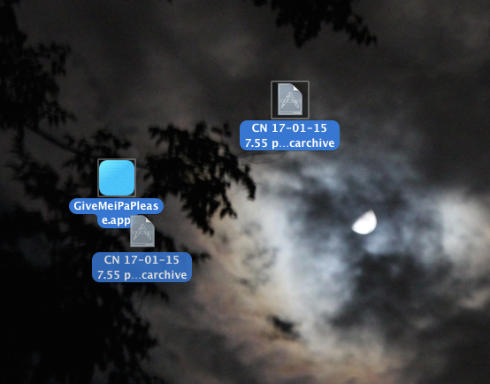

## Give me ipa pls

Xcode 6 - Give me iPa please

Xcode 6 requires you to import your developer profile or have iTunes account credentials to create an ipa file. 

Most of the time, customers do not share their credentials and apps shared by two different team do not share their credentials. They only pass the certificates and provisioning profiles to share the build.

So I've spent little time to create a Applescript droplet to run the command to generate *.ipa from .xcodearchive files.

It just opens terminal and run the command. One less command I need to remember. It doesn't handle errors but you can see the output in terminal.

### How to use
Just drag the .xcodearchive and drop on to the givemeipapls.app

